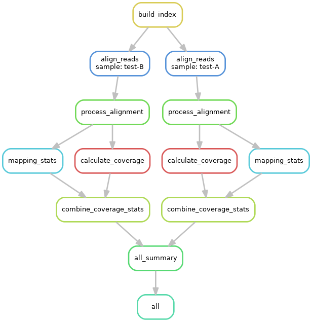

# viruSnake
A snakemake workflow to download/align reads to targets and produce useful outputs. 

## Installing

Getting it up and running is hopefully simple (maybe there'll be an install script to handle this later):

    git clone https://github.com/louiejtaylor/viruSnake
    cd viruSnake
    
We use conda to handle dependencies, you can install miniconda from [here](https://conda.io/miniconda.html). Make a new conda enviroment, then install dependencies from `requirements.txt` like so:
    
    conda create -n viruSnake
    source activate viruSnake
    conda install -c bioconda -c conda-forge --file requirements.txt 
    
Conda is great for managing dependencies and environments without requiring any admin privileges.

## Running

To run, all you need is a config file to point Snakemake to your data and targets (see `test_data/test_config.yml` for an example), then run the following in the viruSnake root dir:

    snakemake -p --configfile [your_config.yml] all
    
For an example, you can run the dummy data (which should complete in under a minute):

    snakemake -p --configfile test_data/test_config.yml all
    
If you want to run the dummy data again after tinkering with the Snakefile or rules, you can clean up the test output like so:

    cd test_data
    bash clean_test.sh

When you're done, to leave the conda environment:

    source deactivate

## Current workflow (generated by [graphviz](https://www.graphviz.org/doc/info/lang.html))

